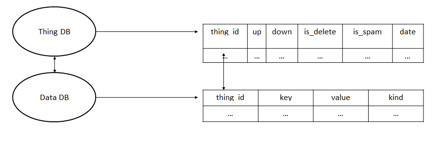
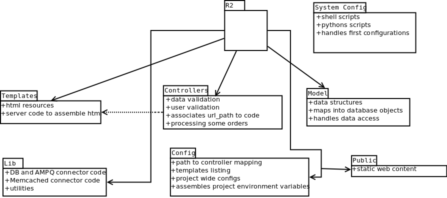
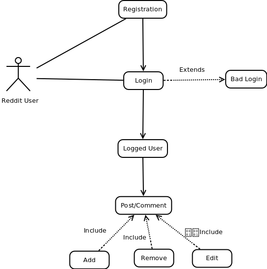

# Reddit: The front page of the internet

Group Elements
==================
 - José Soares
 - Marcelo Gomes (https://github.com/marcelo-gomes)
 - Maria Costa (https://github.com/MariaBacelar)
 - Pedro Cabral	(https://github.com/up201003803)
 - Ricardo Leite (https://github.com/Nespa32)

Table of Contents
==================
* [Introduction](#introduction)
* [4+1 Architectural Views](#41-architectural-views)
  * [Logical View](#logical-view)
  * [Process View](#process-view)
  * [Development view](#development-view)
  * [Physical view](#physical-view)
  * [Scenarios](#scenarios)

#Introduction
===================
[Reddit](https://reddit.com) is a social news and link aggregrator website where users post links from the Internet, as well as  their original content.  
It was launched in June 23rd, 2005, and as of the begining of 2016, it has a few billion monthly page views. 
The backend is mostly built in Python, with a PostgreSQL database, and several side technologies added over time, as the website needed to keep up with the larger and larger traffic.
Reddit is licenced under CPAL.

----------
Its main technological components include:

 - Python: high-level, general-purpose, interpreted, dynamic programming language.

 -  Pylons: A web framework for Python.

 -  PostgreSQL: Primary backend database. Used to store all permanent data, including accounts, posts, comments.
PostgreSQL is an advanced object-relational database management system that supports an extended subset of the SQL standard, including transactions, foreign keys, subqueries, triggers, user-defined types and functions. It has native programming interfaces for C/C++, Java, .Net, Perl, Python, Ruby, Tcl, ODBC, among others.

 - HAProxy: A TCP/HTTP load balancer, suited for very high traffic web sites.
 
 - Cassandra: Secondary database system, used for caching computed values (NoSQL, key-value store).
 
 - Memcached: For caching and ad-hoc locking/synchronization between architectural components. Almost everything on reddit depends on memcached running properly.

 - RabbitMQ: An implementation of AMQP, used to store jobs for offline processing.

----------

####Functional requirements

- Reddit has to be able to serve a social news and link aggregator website, where users can submit content, and comment on other user's content. 
- Users are able to 'upvote' and 'downvote' submissions and user comments, and user comments for a given submission are presented in a orderable tree-style. Submissions belong to a given area, called 'subreddit'. Users can subscribe to subreddits.  
- Reddit presents a 'front page' for a given user depending of their subreddit subscriptions, and whether they are a (registered) user at all. This page has recent submissions ordered according to score.

####Non-functional requirements

- Response Time - Need to ensure a fast response so the browsing is fluid even with big throughput or data volumes.
- Avaliability - website downtime has to be minimal, having the service running as long as possible, keeping it avaliable to geographically disperse users.
- Scalability - reddit has to able to scale as necessary to handle traffic surges, as well as ever-increasing traffic demands. All of this with acceptable QoS.
- Authentication/Security - Must allow the identification of users who try to access his account, while protecting the system from possible invaders.
- Usability - QoS affects the user's interaction with the website and his satisfaction with it , and the QoS will have to ensure that the user wants to re-use it so usability must be a point to take in count.

----------

Reddit is primarily deployed on AWS, along with S3 storage for static objects.

Amazon Elastic Compute Cloud (Amazon EC2) is a web service [AWS] that provides resizable compute capacity in the cloud. 
It was designed to facilitate cloud computing on the web scale for developers. The service interface simple Amazon EC2 Web makes it possible to obtain and configure capacity, with minimal friction.

###*Why AWS?*

 - **Scales up or down as needed:**
	 * AWS allows launching and destroying 'instances' on the run, with little wait time before the new 'hardware' is acquired. This is useful for websites that have spikes of traffic, as one can simply keep launching instances to meet the load requirements.
	 
 - **Instance management can be done via API:**
	* Meaning instance launch/destruction lifecycle can be done without having a sysadmin watching 24/7. Utilities such as instance reboot and reset are also provided, which eases up administration and allows 'cleaning up' as needed.

 - **It can be used with other Amazon services:**
	* It works in conjunction with Amazon Simple Storage Service (Amazon S3), Amazon Relational Database Service (Amazon RDS), 
Amazon SimpleDB and Amazon Simple Queue Service (Amazon SQS), to provide a complete solution for computing, processing consultation and storage of a wide variety of applications.

 - **It is reliable:**
	* Amazon EC2 guarantees 99.95% availability, and is widely used in industry. It eases some of the vendor lock-in fears.

=======
System Requirements
===================
Reddit can be run on any Linux distribution (with sufficient setup work thrown at it). It can be trivially setup on Ubuntu with an [install script](https://github.com/reddit/reddit/wiki/reddit-install-script-for-Ubuntu).

#4+1 Architectural Views

#Logical View

####Activity Diagram

The base architecture for reddit is fairly simple. A user agent (which can be a browser with a human behind, or a standalone program) connects to the server via HTTP and does GET for some given webpage, or a POST. Depending of the action and the contents of the GET/POST, the HTTP server grabs data from the Postgres data or one of the various caching mechanisms (memcached, Cassandra) before a webpage is built and sent via HTTP RES.
Some actions don't necessarily need an immediate server response to the user, and can be processed asynchronously in the architecture. Such actions are queued up on RabbitMQ (which is just an AMPQ implementation) to be consumed by python scripts.
Various trade-offs and architectural choices are well visible here. A lot is done with the goal of mitigating load on the PostgreSQL. Memcached is first consulted for any queries done, which adds a layer of indirection for all data fetches. This ultimately spares PostgresSQL of constantly fetching commonly used data.
Furthermore, expensive computed results are cached in Cassandra, in a semi-permanent basis, which spares further query load on each user request. In fact, all the queue jobs do is update these expensive computed results.
The name of the game is caching, and the user thee who can wait for updated content.

####HTTP Server Expansion

The HTTP server's structure resembles Model-view-controller. In the configuration, url paths are associated with Controllers. When a user does a HTTP GET or POST, the Controller is instanciated and called. The Controller accesses the Model for data fetches or updates, without being able to directly touch the database or the various caching mechanisms.
Depending on the request, the Model can behave differently on choosing the database to use when the information isn't already present in the model. When there is an update on the data, the model can store it on the database using the code present on the ThingDB. 
The response for a given user GET to the controller is generated by a Template where the html code is avaliable. 
The MVC structure in this project is inherited by Pylons, which is a web development library. This structure is not strictly followed on the organization of the reddit server. 

####Database

The reddit database is built on two different systems, with two different objectives.  
Cassandra is used to store pre-computed information, like the order of the posts and attributes in the front page. These are complex objects that are stored temporarily. Cassandra behaves as a cache which is accessed by the http server generating the web page immediately, as the user asks, minimizing the amount of queries that the other databases receive.  
The permanent storage database of reddit is organized on a Postgres system and it is responsible for the storage off all the back-end information. In this database we can find user account information, subbredits, etc. 
Postgres is a relational database. However reddit doesn't use this feature, it instead uses Postgres as a key/value store with a Thing/Data pair to organize information. 
The Thing/Data pair is a dual database structure where the information is divided in metadata (Thing) and information (Data) connected by one ID. The Thing database stores only information that is applied to all the items - "things" - in reddit, in this case, upvotes and downvotes. In order to access more information on a said "thing", a thing_ID must be known and you have to cross it with a key in the Data database, in order to access it. 
The main reason databases are implemented in this way is because on reddit almost everything is considered as "things" and have the same attributes. Things were deployed and work well this way, because it is easier to access things from one database or another and most part of the accesses to the databases are separated. 
There are benefits and detriments to this implementation, the main benefits are not only the fact that, if you change one field, you don't have to change the whole database, but also, the "default value" set for the objects with no value that keep the database with no repeated information and doesn't force to set a value manually. The most important benefit is the fact that with these two separated tables with no relations between them, reddit can have its database system on different machines, decentralizing and making the system scalable. 
The bad part of this implementation comes from the part that, to select a "thing"  from the database, reddit may be needed to access several tables that can be on different computers. A relational system can be more efficient in terms of time.

####**Class Diagram**

Classes used to store data and the database structure design are tightly connected. "Thing" has all of the attributes that will be stored in the Thing tables described previously. Derived classes have all their attributes stored in the Data tables.
Let's reflect for a moment on the consequences of having derived class attributes be stored on the Data tables. Because the Data tables behave as a key-value store, if during development an extra attribute has to be added during to a class, it can be done at runtime without modifying the database structure. During data fetches, if a given attribute is not found, we can plant in a default. That gives this design wonderful flexibility.
However the trade-off when looking from a practical perspective is that the data tables have values of any type - it might be a string, it might be an integer, it might be a timestamp, it might be an IP address. Regardless, all of it has to be stored under a common type. We might even have to store the type of the value along the value. This is not very space-efficient, and immediately offsets the flexibility given by this database design.

#Process View

####Subtitle
U - User 
H - HTTP server 
M - Memcached 
C - Cassandra Database 
P - Postgres Database   
Q - RabitMQ 
Co- Consumer

####Post

When someone wants to insert a post on Reddit, the first step is to send an HTTP POST to the HTTP server. On a second step, the server will check Memcached to see if there already is information present, using a GET through a unix or a TCP socketand it will also check on Cassandra, using a SELECT instead. Then, the server hits the Postgres with several queries, getting the result from the database in the form of a Remote Procedure call.  
The final step of this procedure consists on the HTTP server sending the response to the the user.

####Comment

The process of creating a comment on Reddit starts from sending an HTTP POST to the HTTP server. The comment is then inserted on Memcached and on Postgres and an OK response is sent to the user. This marks the end of the user's interaction with Reddit. 
Even though the user receives an OK response, he will not see his comment on the right spot of the page (inserted in a tree).  The process of reordering the comment tree is done in "back-end".  
After sending the response to the user, the server adds the comment to a queue waiting, for the consumer to handle it.  
After sorting the comment tree, the consumer will add it to Cassandra and Memcached.

####Upvote/Downvote

When a user upvotes or downvotes a "thing", the same mechanisms are called. First of all, an HTTP post is sent to the HTTP server. Then, Memcached increments the information displayed on the page instantly and the Up/Downvote is sent to the queue to recompute the information and proceed to sorting the information on the page if needed. At this point the user receives the response from the server.  
After the Up/Downvote is on the queue, it will be fetched by the consumer that will hit the Postgres database with queries in order to retrieve information and to insert the updated information into Cassandra.

#Development view

#Physical view

To allow multiplexing of the HTTP servers to take place, a load balancer (specifically, HaProxy) is placed before HTTP servers. 
HaProxy also allows us to distinguish between traffic intended for different services, which is useful for serving media and static content on a standalone development machine.  
This can be done since HaProxy is a layer 4 load balancer, meaning it can look into the HTTP headers and decide where a request goes.
Memcached is multiplexed by using mcrouter (https://github.com/facebook/mcrouter), which acts as a gate for Memcached access. This allows multiple Memcached instances acting as shards, at the expense of another layer of indirection and some possibility of "chaos" whenever something causes the hashing scheme to change (such as Memcached instance going down). 
For deployment, a replica of the main Postgres databases is used for queued job processing. The reasoning is that these databases are often the bottleneck in response time for regular HTTP requests. Much work in the architecture is devoted to mitigate the number of queries these databases receive. 
However, in the asynchronous part of the architecture, for queue jobs, a lot of heavy database queries are needed. Because the queue jobs have no response time requirements, the machines involved in the queue processing can be run as quickly as possible, and therefore can hit the databases as mercilessly as they can. 
As this is undesirable for the main databases, a replica set that is mirrored periodically is used. Of course, a trade-off here is that the queue jobs might occasionally work on outdated data. This is mostly mitigated by Memcached, which has a cache time-out larger than the replication period, and thus is likely to have recent data for which the replica databases are outdated. 
Cassandra can scale to any number of machines if need-be, due to the ring cluster architecture it uses. Cassandra instances are assigned a token that determines their slot in the ring. The key used on data fetches maps to a region in the ring. Since Cassandra only stores computed data, there's no concern for data replication, which simplifies scaling up/down the number of machines.

Due to architectural decisions mentioned earlier, the Postgres database can be split into 2 separate databases, that can be run on separate machines. This is particularly effective since often in data fetches, only data from one of the databases is needed at a time. 
One of the databases stores "Thing" tables. All "Thing" tables use the same columns (thing_id, upvotes, downvotes, deleted, spam, date). The other database stores attributes belonging to each "Thing", resembling a key-value store. 
For example, an account is a "Thing" with attributes such as "password", "name", "email". The attribute name serves as key in the key-value store.

#Scenarios

