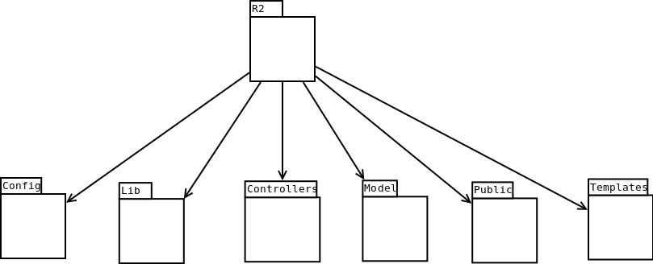
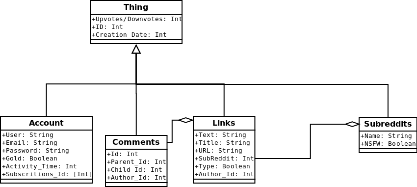
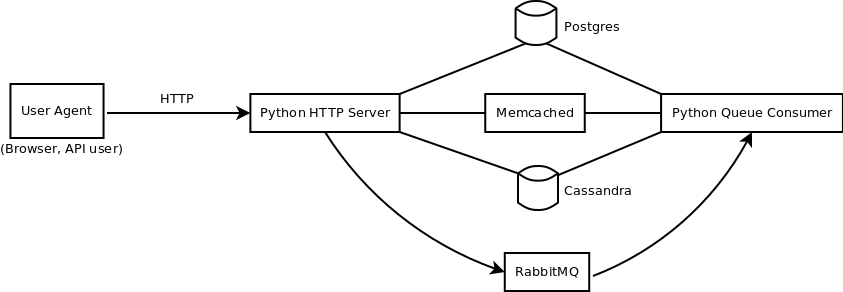
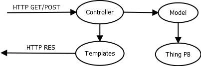
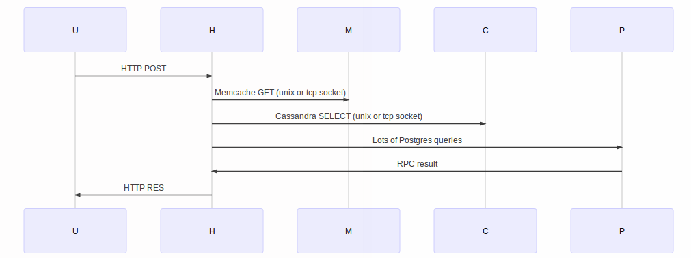
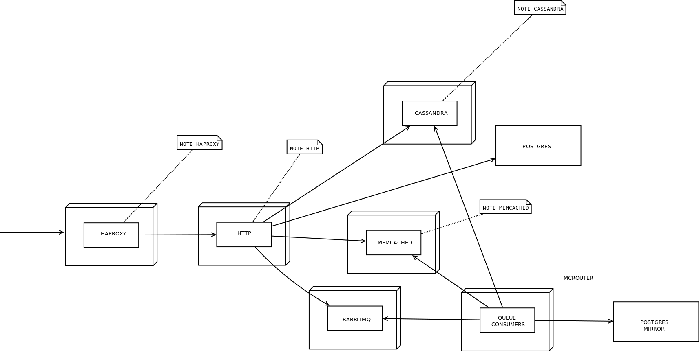
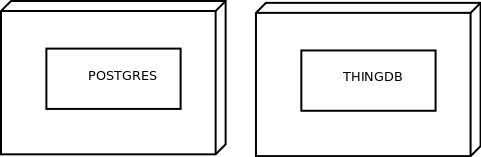

# **Reddit**  

Group Elements
==================

 - José Soares
 - Marcelo Gomes
 - Maria Costa
 - Pedro Cabral
 - Ricardo Leite

Table of Contents
==================
* [A Brief Overview](#a-brief-overview)
* [4+1 Architectural Views](#41-architectural-views)
  * [Logical View](#logical-view)
  * [Process View](#process-view)
  * [Development view](#development-view)
  * [Physical view](#physical-view)
  * [Scenarios](#scenarios)

#**A Brief Overview**
===================

[Reddit](https://reddit.com) is a social news and link aggregrator website where users, or ***Redditors***, post links from the Internet, as well as  their original content. 
It was launched in June 23rd, 2005, and as of the begining of 2016, it has a few billion monthly page views.
The backend is mostly built in Python, with a PostgreSQL database, and several side technologies added over time, as the website needed to keep up with the larger and larger traffic.
Reddit is licenced under CPAL.

----------
####**System requirements:**
 The system requires a server-grade machine running a linux distributuion (of the users choise) and amd64.

----------
Its main technological components, by subjective order of importance, include:

 - Python: With a ton of extra libraries. A noteworthy library would be Pylons.

 -  Pylons: A web framework.

 -  PostgreSQL: Primary backend database. It is used for storing data on Accounts, Subreddits, Links, Comments, Votes, etc. 
PostgreSQL is an advanced object-relational database management system that supports an extended subset of the SQL standard, including transactions, foreign keys, subqueries, triggers, user-defined types and functions. It has native programming interfaces for C/C++, Java, .Net, Perl, Python, Ruby, Tcl, ODBC, among others.

 - HAProxy: Essentially an HTTP load balancer, suited for very high traffic web sites. In fact, it powers quite a number of the world's most visited ones.
 
 - Cassandra: Secondary database system, used for caching (NoSQL, key-value store).
 
 - Memcached: For caching and ad-hoc locking/synchronization between architectural components. Almost everything on reddit depends on memcached running properly.

 - RabbitMQ: An implementation of AMQP, used to store jobs for offline processing.

----------

####**Functional requirements:**

Reddit has to be able to serve a social news and link aggregator website, where users can submit content, and comment on other user's content.
Users are able to 'upvote' and 'downvote' submissions and user comments, and user comments for a given submission are presented in a orderable tree-style. Submissions belong to a given area, called 'subreddit'. Users can subscribe to subreddits.
Reddit presents a 'front page' for a given user depending of their subreddit subscriptions, and whether they are a (registered) user at all. This page has recent submissions ordered according to score.

####**Non functional requirements:**

- Response Time - Need to ensure a fast response so the  browsing is fluid even with big throughput or data volumes.
- Avaliability - The Downtime of the website must be minimized, having the service running as long as possible, keeping it avaliable to the user.
- Scalability - Need to ensure that even with an overload of the website service will continue to run ensuring acceptable QoS.
- Authentication/Security - Must allow the identification of users who try to access his account , while protecting the system from possible invaders.
- Usability - QoS affects the user's interaction with the website and his satisfaction with it , and the QoS will have to ensure that the user wants to re-use it so usability must be a point to take in count.

----------

Reddit is primarily deployed on AWS, along with S3 storage for static objects.

Amazon Elastic Compute Cloud (Amazon EC2) is a web service [AWS] that provides resizable compute capacity in the cloud. 
It was designed to facilitate cloud computing on the web scale for developers. The service interface simple Amazon EC2 Web makes it possible to obtain and configure capacity, with minimal friction.

###*Why AWS?*

 - **Scales up or down as needed:**
	 * AWS allows launching and destroying 'instances' on the run, with little wait time before the new 'hardware' is acquired. This is useful for websites that have spikes of traffic, as one can simply keep launching instances to meet the load requirements.
	 
 - **Instance management can be done via API:**
	* Meaning instance launch/destruction lifecycle can be done without having a sysadmin watching 24/7. Utilities such as instance reboot and reset are also provided, which eases up administration and allows 'cleaning up' as needed.

 - **It can be used with other Amazon services:**
	* It works in conjunction with Amazon Simple Storage Service (Amazon S3), Amazon Relational Database Service (Amazon RDS), 
Amazon SimpleDB and Amazon Simple Queue Service (Amazon SQS), to provide a complete solution for computing, processing consultation and storage of a wide variety of applications.

 - **It is reliable:**
	* Amazon EC2 guarantees 99.95% availability, and is widely used in industry. It eases some of the vendor lock-in fears.

<<<<<<< HEAD

=======
**System Requirements**
===================
Reddit can be run on any Linux distribution (with sufficient setup work thrown at it). It can be trivially setup on Ubuntu with an [install script](https://github.com/reddit/reddit/wiki/reddit-install-script-for-Ubuntu).
>>>>>>> fdd15651491cbc116c224b642d41ec2d07762b91

#**4+1 Architectural Views**

#**Logical View**

###**Package Diagram**

####**Class Diagram**

####**Activity Diagram**

####**HTTP Server Expansion**

The HTTP server of Reddit can be described as a Model-view-controller. When a user interacts with the Controller through HTTP GETs and POSTs, he accesses the Model data that is retrieved according to commands present in the controller, updating and changing the model state.
Depending on the request, the Model can behave differently on choosing the database to use when the information isn't already present in the model. When there is an update on the data, the model can store it on the database using the cod DB. e present on the THing
The response for a given user GET to the controller is generated by a Template where the html code is avaliable.
The MVC structure in this project is inherited by Pylons, which is a web development library. This structure is not strictly followed on the organization of the reddit server. 

####**Database**

The reddit database is built on two different systems, with two different objectives. 
Cassandra is used to store pre-computed information, like the order of the posts and attributes in the front page. These are complex objects that are stored temporarily. Cassandra behaves as a cache which is accessed by the http server generating the web page immediately, as the user asks, minimizing the amount of queries that the other databases receive. 
The permanent storage database of reddit is organized on a Postgres system and it is responsible for the storage off all the back-end information. In this database we can find user account information, subbredits, etc.
Postgres is a relational database. However reddit doesn't use this feature, it instead uses Postgres as a key/value store with a Thing/Data pair to organize information.
The Thing/Data pair is a dual database structure where the information is divided in metadata (Thing) and information (Data) connected by one ID. The Thing database stores only information that is applied to all the items - "things" - in reddit, in this case, upvotes and downvotes. In order to access more information on a said "thing", a thing_ID must be known and you have to cross it with a key in the Data database, in order to access it.
The main reason databases are implemented in this way is because on reddit almost everything is considered as "things" and have the same attributes. Things were deployed and work well this way, because it is easier to access things from one database or another and most part of the accesses to the databases are separated.
There are benefits and detriments to this implementation, the main benefits are not only the fact that, if you change one field, you don't have to change the whole database, but also, the "default value" set for the objects with no value that keep the database with no repeated information and doesn't force to set a value manually. The most important benefit is the fact that with these two separated tables with no relations between them, reddit can have its database system on different machines, decentralizing and making the system scalable.
The bad part of this implementation comes from the part that, to select a "thing"  from the database, reddit may be needed to access several tables that can be on different computers. A relational system can be more efficient in terms of time.

#**Process View**

####**Subtitle**
U - User
H - Http server
M - Memcached
C - Cassandra Database
P - Postgres Database
Q - RabitMQ
Co- Consumer

####**Post**

When someone wants to insert a post on Reddit, the first step is to send an HTTP POST to the HTTP server. On a second step, the server will check Memcached to see if there already is information present, using a GET through a unix or a TCP socketand it will also check on Cassandra, using a SELECT instead. Then, the server hits the Postgres with several queries, getting the result from the database in the form of a Remote Procedure call. 
The final step of this procedure consists on the HTTP server sending the response to the the user.

####**Comment**

The process of creating a comment on Reddit starts from sending an HTTP POST to the HTTP server. The comment is then inserted on Memcached and on Postgres and an OK response is sent to the user. This marks the end of the user's interaction with Reddit.
Even though the user receives an OK response, he will not see his comment on the right spot of the page (inserted in a tree).  The process of reordering the comment tree is done in "back-end". 
After sending the response to the user, the server adds the comment to a queue waiting, for the consumer to handle it. 
After sorting the comment tree, the consumer will add it to Cassandra and Memcached.

####**Upvote/Downvote**

When a user upvotes or downvotes a "thing", the same mechanisms are called. First of all, an HTTP post is sent to the HTTP server. Then, Memcached increments the information displayed on the page instantly and the Up/Downvote is sent to the queue to recompute the information and proceed to sorting the information on the page if needed. At this point the user receives the response from the server. 
After the Up/Downvote is on the queue, it will be fetched by the consumer that will hit the Postgres database with queries in order to retrieve information and to insert the updated information into Cassandra.

#**Development view**

#**Physical view**

#**Scenarios

