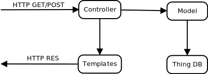
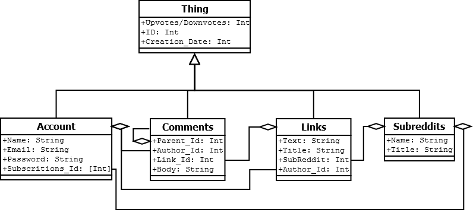
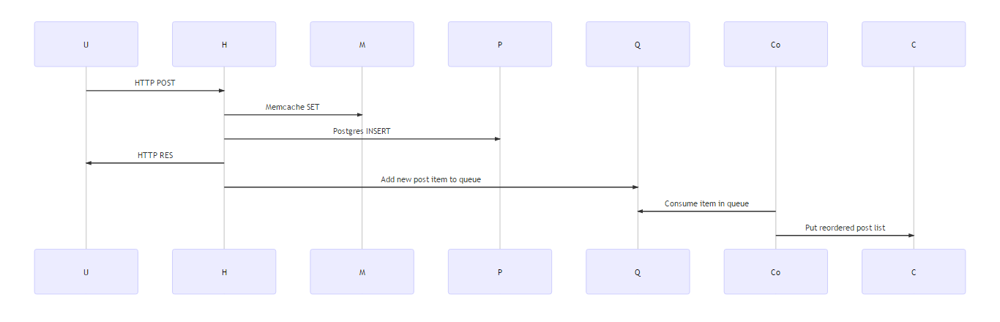
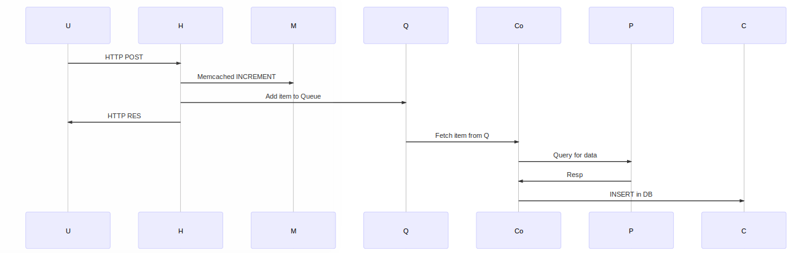
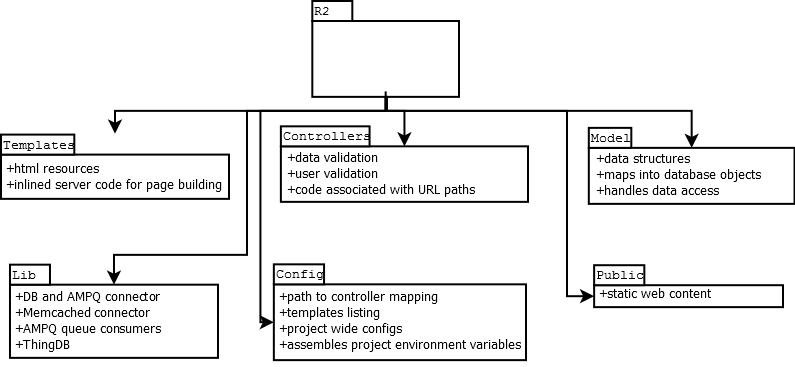
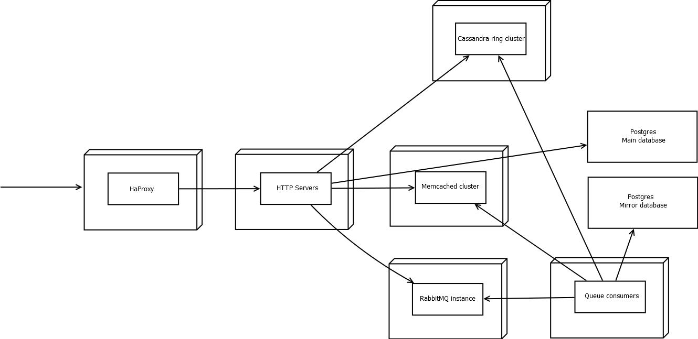
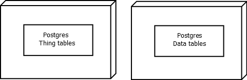
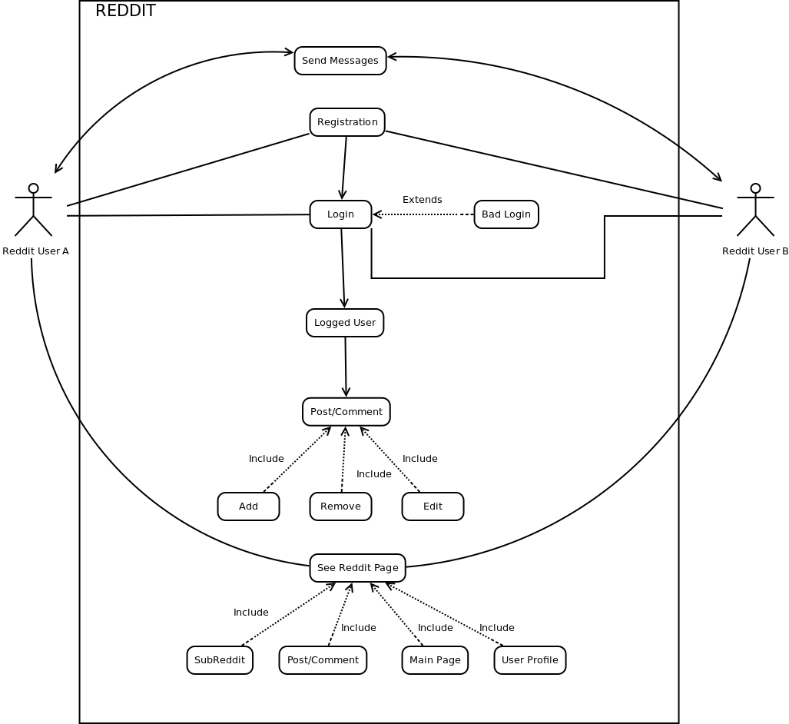

#Table of contents

The overview covers the first part of the report.

Here lies the report for our project, covering the 4+1 architectural views of reddit.

#Diagrams

####Activity Diagram

####HTTP Server Expansion

####Database

####**Class Diagram**

####Post

####Comment

####Upvote/Downvote

#Development view
 

#Physical view

 

#Scenarios

